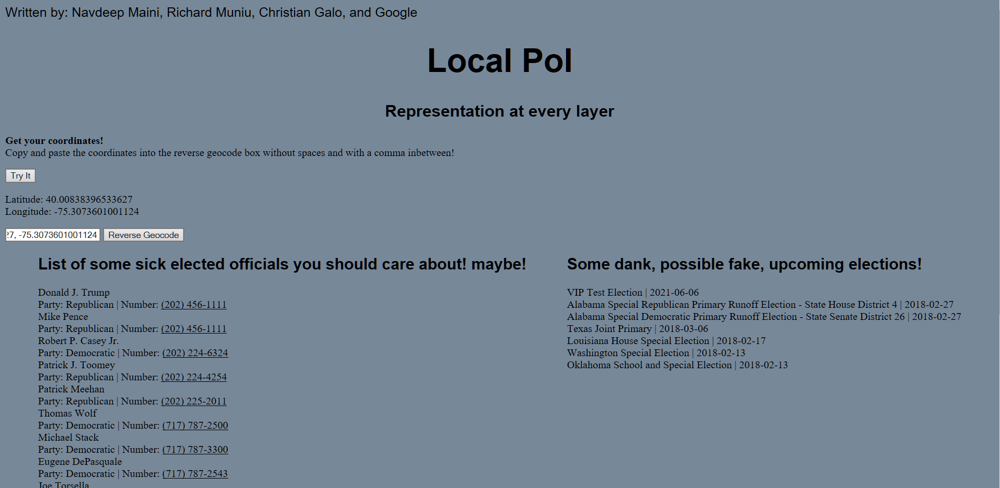
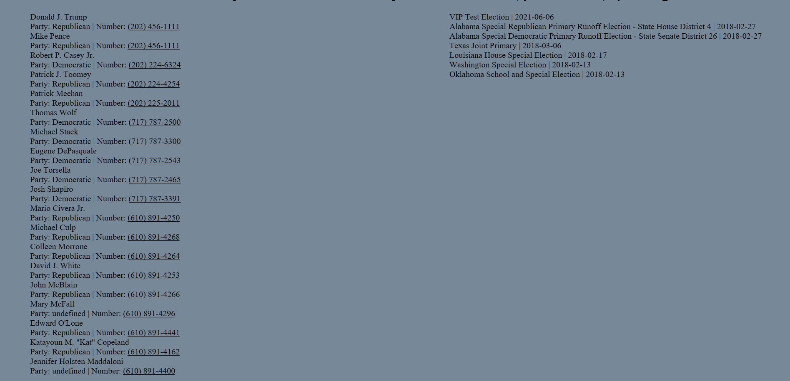

# LocalPol

Hack the Tri-Co Hackathon

Project: Local Pol
Authors: Navdeep M, Christian G, Rick M
This project wants to make it much easier to have access to local political data. We think that people tend to know who their higher-ups are in
regards to elected officials, but the local-area is a bit more of a grey-area. Using geolocation and google's civic api, we tried to get some
relevant data for the user!

user location link
https://developers.google.com/web/fundamentals/native-hardware/user-location/

Civic Data google
https://developers.google.com/civic-information/docs/using_api?nav=true#voterInfoQuery_Response

